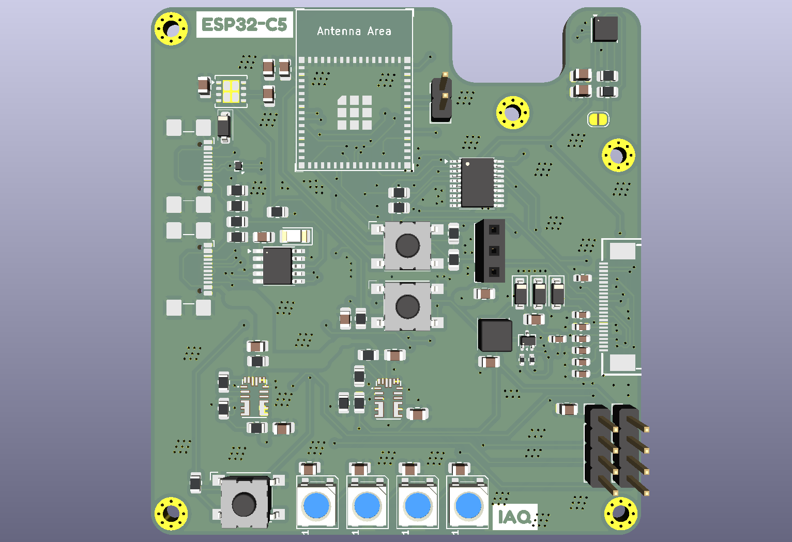

### CAIR

---

Indoor Air Sensing EVT module for BME690 and SPS30

### High Level System Architecture

1. Features an ESP32C5
2. BME690 and the Sensiron SP30
3. E-Ink Display
4. USB PD for high power 5V accessories
5. WLED array for high priority information
   
   
   
   
   

### Software priorities

1. HMI strategy
2. End-End data-logging
3. SNTP (Time Sync)
4. BME690 Model development
5. Sensiron SP30 cleaning cycle scheduler
